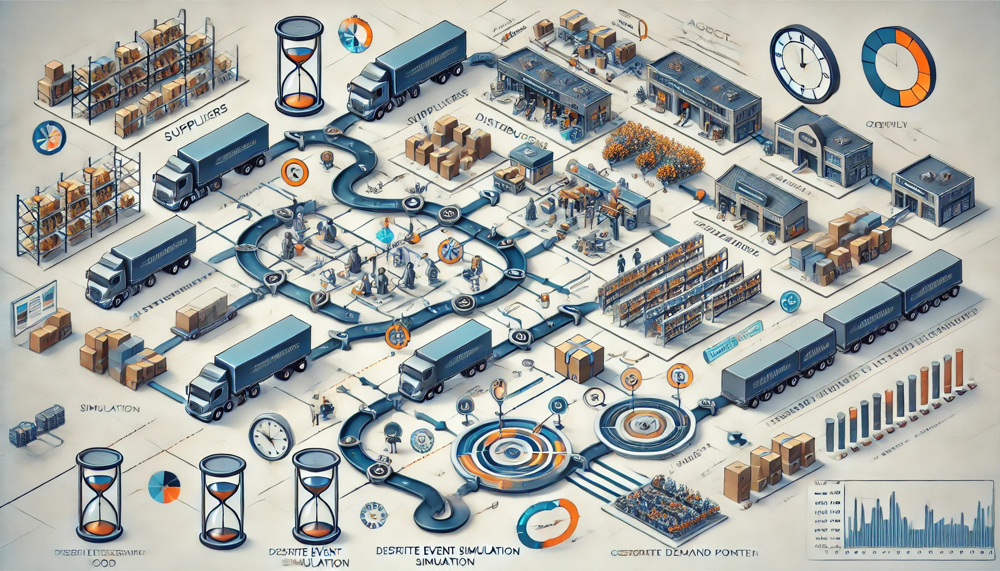

## What is simulation:
Simulation in supply chain management is the process of creating a digital model of a supply chain or its components to analyze, test, and optimize the behavior of the system under different conditions. This approach enables decision-makers to experiment with strategies and policies in a risk-free environment. Here are some common types of simulation models used in supply chains:

Simulation involves creating a virtual model of supply chain operations to analyze and optimize performance. By simulating processes such as production, logistics, inventory management, and customer demand, organizations can test strategies under various scenarios without risking real-world disruptions.

Simulation model contains:
### Discrete Event Simulation (DES):
DES models systems as a sequence of distinct events, each occurring at a particular point in time. It’s particularly useful for systems where processes happen in a step-by-step manner, like processing orders, transporting goods, or handling customer requests.
-> **Application**: DES is commonly used for modeling warehouses, production lines, transportation logistics, and inventory management, where timing and event-driven changes are crucial.

### Agent-Based Modeling (ABM):
Overview: ABM simulates interactions of individual agents, each with unique behaviors, to analyze complex systems. Agents can represent entities like suppliers, manufacturers, distributors, and customers, each following rules or strategies that influence the overall system.
->**Application**: ABM is useful for studying decentralized systems with independent decision-makers. It’s applied in analyzing supply chain resilience, demand fluctuations, and effects of individual agent decisions on the entire system.

### System Dynamics (SD):
SD is a top-down simulation method that uses feedback loops and stocks and flows to model and analyze the behavior of complex systems over time.
->**Application**: SD is often used for high-level policy analysis and to study the long-term impact of strategic decisions, such as capacity planning, demand forecasting, and inventory policies.

## Simulation in R:
### Definition:
In R, the `simmer` package is commonly used for Discrete Event Simulation (DES) and Agent-Based Modeling (ABM), which helps build detailed models of supply chains. Using `simmer`, you can create agents that represent entities (e.g., suppliers, customers) and simulate their interactions and activities over time. This allows for in-depth testing and analysis, helping to improve decision-making in supply chain management.

`simmer` is an R package designed specifically for Discrete Event Simulation (DES). It is inspired by the SimPy framework in Python and is particularly suitable for simulating complex systems like supply chains, healthcare processes, and manufacturing operations.

### Example:
Key Features:
  - **Process-Oriented**: The package allows users to define processes as "trajectories," which are sequences of actions and events.
  - **Resource Management**: It provides powerful tools for managing resources, queues, and priority scheduling, making it ideal for logistics and production processes.
  - **Statistical Tracking**: `simmer` has built-in functions to collect and report statistical data (e.g., waiting times, resource utilization) over the simulation run.
  - **Flexibility**: It supports custom functions, allowing users to define complex behaviors within the simulation environment.

By using `simmer` to build a supply chain model, you can explore the impacts of different decisions, such as increasing the number of shipping docks, adjusting schedules, or implementing new routing policies. This makes it a powerful tool for operational and strategic planning in supply chain management.

**Example of simmer in Supply Chain**:
  Suppose you want to simulate a warehouse where orders are processed and shipped. You could use `simmer` to:
  - Define different resources (e.g., loading docks, forklifts).
  - Set up trajectories (order receiving, picking, packing, and shipping).
  - Monitor performance metrics like average processing time or resource utilization, which are critical for optimizing operations.

